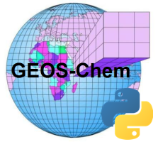

.. NOTE: This is just a basic mock-up documentation page.

    Ideas:

        1) Gallery like in the unidata page here: https://unidata.github.io/python-gallery/examples/index.html
        2) nbsphinx: http://nbsphinx.readthedocs.io/en/0.2.13/usage.html#Installation
        3) Jiawei's notebooks:
            https://github.com/JiaweiZhuang/GCHP_python/blob/master/benchmark_tutorial.ipynb
            https://github.com/JiaweiZhuang/GCHP_python/blob/master/gamap_tutorial.ipynb
        4) Simple documents in Markdown:
            http://www.sphinx-doc.org/en/stable/markdown.html
            It might be easiest for users to modify Markdown pages instead of
            ReST
        5) GCST/GCPY
            https://bitbucket.org/gcst/gcpy
        6) sphinx-gallery
            http://sphinx-gallery.readthedocs.io/en/latest/index.html

    In terms of examples/galleries, there are two routes to go. On the one hand,
    tools like sphinx-gallery (which is used by seaborn, astropy, scikit-learn,
    and many more) require you to whip up a simple Python script with very light
    annotations for split it into parts, notebook-style. Astropy has a companion
    project, astropy-tutorials, which has long-form tutorials in notebooks that
    render straight on the site. I'm not sure which is more suitable here, but for starters I'm going to make a few examples the sphinx-gallery style.

    A third option is to seed expository writing with ipython directives, like
    I did in the xbpch documentation. This gives you a great degree of control,
    but everything has to be configured in the sphinx toctree or with
    autogenerated stubs, which could be cumbersome. It would be a bit easier to
    mix/match static content with programatic content, though.

    ---

    It would be great if there were a way to add "keywords" to certain examples,
    so that they could be filtered from the website and a user could dial down
    to what they really want. So for instance, perhaps you have an analysis with
    four conceptual parts:

    1. Read a BPCH file
    2. Do a timeseries analysis on it
    3. Plot it on a geographic projection...
    4. ... with multiple subplots

    It's *possible* that there would be one specific example for this analysis.
    And, in an ideal world where users are contributing to the examples, we could
    definitely include one. But realistically, each of the four parts of this
    analysis are going to come from at least 3-4 different examples. But if we
    could filter examples by tags or keywords, then we might be able to provide
    users a very easy way to access the examples with the key components they
    care about.

    ---

    Mixing a gallery of "Examples" with some long-form "Tutorials" is probably the
    best way to go. For example, the MNE library has a great split
    http://www.martinos.org/mne/stable/auto_examples/index.html

    1. Examples gallery (sphinx_gallery)
    2. Tutorials (sphinx_gallery; slightly longer-form examples)
    3. Manual / Cookbook (long-form, probably just with IPython blocks)

    ---

    The examples are *definitely* going to need a template and style guide.

    ---

    We can probably publish the docs on some arbitrary server. We don't have to
    rely on RTD; we could come up with our own, appropriate theme based on ones
    already available, and maintain our own automatic build/deployment.

GCPy: Python-powered GEOS-Chem analysis/visualization
=====================================================

GCPy is a basic toolkit for helping GEOS-Chem users tackle their research analyses
using the free, powerful tools available in the modern scientific computing ecosystem. Additionally, the documentation for GCPy features many examples on how
to do common analysis and visualization tasks using this software stack. We hope
that users throughout the GEOS-Chem community will not only find this useful, but
will both learn new (hopefully easier!) ways to perform their common tasks and
contribute new knowledge back to the community by publishing examples here.

Table of Contents
=================

.. toctree::
   :maxdepth: 1

   python
   getting_started
   tutorials/tutorials
   examples/index

.. Indices and tables
.. ==================
..
.. * :ref:`genindex`
.. * :ref:`modindex`
.. * :ref:`search`
